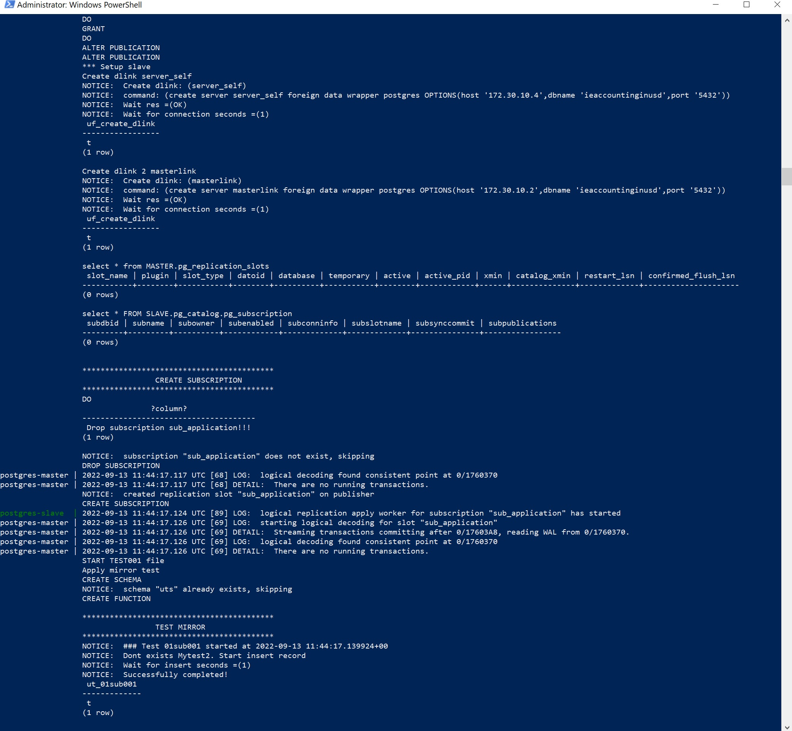

#System Requirements
	Windows 10 64-bit: Pro, Enterprise, or Education (Build 15063 or later).
	Hyper-V and Containers Windows features must be enabled.
	
#Install docker 
1) install Docker Desktop Installer.exe  (download https://docs.docker.com/docker-for-windows/install/ )
2) docker -> Settings -> Shared Drives   share drive with project
3) Check docker setup
 docker run --rm -v c:/Users:/data alpine ls /data
 
#RUN
-rebuild master and slave postgres environment:
```
./db_start.ps1    
```
or 
```
docker-compose -f docker-compose.yml up   
```
<p align="center">
  
</p>

-launch test from dc_postgres/test001.sh:
```
./Test_Start.ps1
```

#Connections:
To master DB :
		localhost
user: 	postgres
pwd: 	postgres
port: 	54321
To slave DB
port:   54322


#Other cmd
restart slave DB server:
docker exec -it postgres-slave gosu postgres pg_ctl restart
exec cmd:
docker exec -it postgres-slave bash

#setup DB server
listen_addresses = '172.30.10.2' Master
listen_addresses = '172.30.10.4' Slave
wal_level = logical	
max_stack_depth = 2MB -> 4MB
work_mem = 4mb -> 16MB

	
### TODO Liquibase 
https://habr.com/ru/post/333762/
install java docker alpine
1) apk add openjdk8-jre
2) apk update
3) apk add maven

wget https://github.com/liquibase/liquibase/releases/download/v3.8.6/liquibase-3.8.6.tar.gz
wget https://jdbc.postgresql.org/download/postgresql-42.2.10.jar

wget https://github.com/liquibase/liquibase/releases/download/v3.6.2/liquibase-3.6.2.tar.gz
wget https://github.com/liquibase/liquibase/releases/download/liquibase-parent-3.6.2/liquibase-3.6.2-bin.tar.gz

mkdir /liquibase &&\
cd /liquibase &&\
export PATH=$PATH:/liquibase 

cp /prj/liquibase-3.8.6.tar.gz liquibase-3.8.6.tar.gz &&\
tar xzvf liquibase-3.8.6.tar.gz
#cp /prj/liquibase-3.6.2-bin.tar.gz liquibase-3.6.2-bin.tar.gz &&\
#tar xzvf liquibase-3.6.2-bin.tar.gz

cp /prj/liquibase.properties liquibase.properties &&\
cp /prj/postgresql-42.2.10.jar postgresql-42.2.10.jar &&\
cp /prj/db.changelog.xml db.changelog.xml

cd /dbupgrade
liquibase --defaultsFile=/prj/liquibase.properties --url=jdbc:postgresql://172.30.10.2/iss_dev --changeLogFile=/dbupgrade/app/changelog/004_app_user.xml status
liquibase --defaultsFile=/prj/liquibase.properties --url=jdbc:postgresql://172.30.10.2/iss_dev --changeLogFile=/dbupgrade/app/changelog/004_app_user.xml upgrade

###Backup and restor DB
pg_dump -U postgres -p 5432 db >> /prj/db.bak --schema-only
psql -U postgres  -c "CREATE DATABASE tests1;"
psql -v ON_ERROR_STOP=1 --username "$POSTGRES_USER" -d "tests1" < /prj/db.bak
